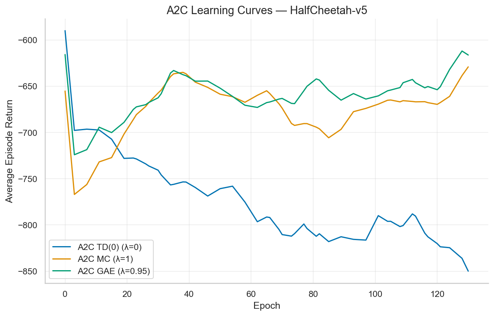
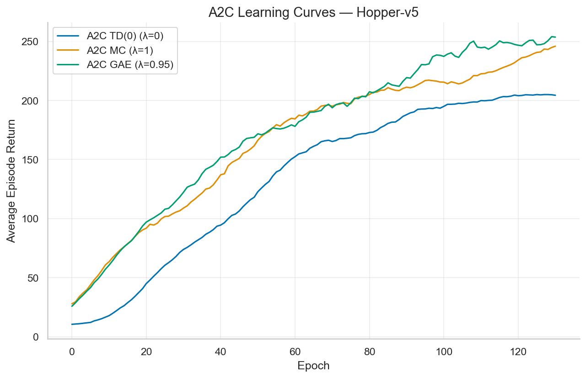
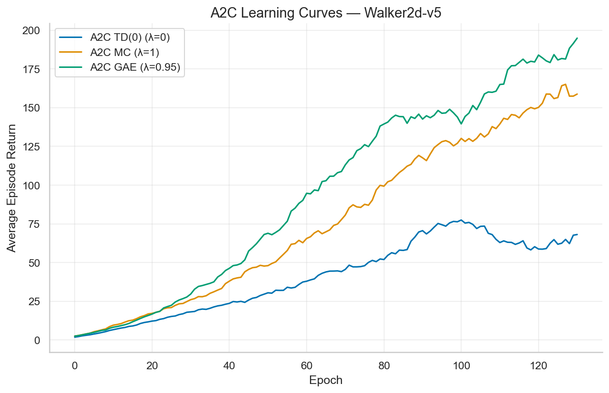
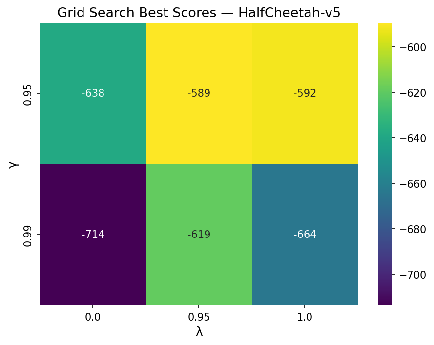
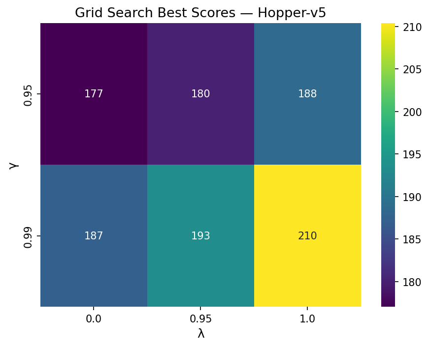
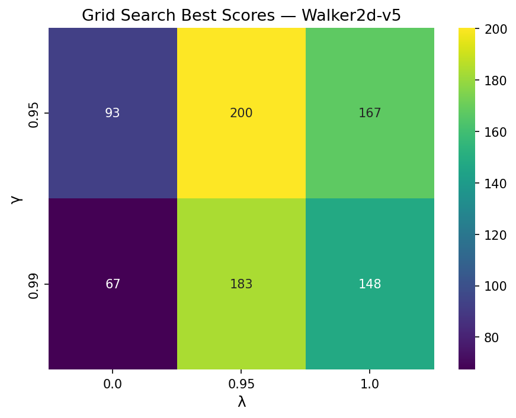

# Week 05 — Advantage Actor-Critic (A2C) on MuJoCo Robotics

## Overview

This project extends a discrete-action A2C implementation to **continuous action spaces** using a Gaussian policy, then benchmarks three advantage-estimation strategies on three [Gymnasium MuJoCo](https://gymnasium.farama.org/environments/mujoco/) robotics environments.

## Key Implementation Work

### Continuous-Action A2C (`a2c.py`)

| Component | What changed |
|---|---|
| **`GaussianPolicy`** (new) | MLP with Tanh activations outputs mean \(\mu(s)\); a learned `log_std` parameter (one per action dim) gives the standard deviation. The policy distribution is `Independent(Normal(μ, σ), 1)`, so `log_prob` sums over action dimensions. |
| **`VectorizedEnvWrapper`** | Now handles both scalar (discrete) and vector (continuous) actions via `action.dim()` dispatch, and **tracks completed episode returns** internally for accurate reward logging. |
| **`ValueEstimator`** | Accepts a `hidden_sizes` parameter so the critic can use deeper networks (e.g. `(64, 64)`) for MuJoCo tasks. |
| **`Policy.learn`** | Added optional `entropy_coeff` for entropy-regularised policy gradient (encourages exploration in continuous spaces). |
| **`a2c()`** | Allocates correct buffer shapes for multi-dimensional actions; returns per-epoch average returns for external plotting. |

### Three A2C Variants

All three differ **only in the GAE λ parameter** — everything else is identical:

| Algorithm | λ | Advantage estimator | Bias–variance tradeoff |
|---|---|---|---|
| **A2C TD(0)** | 0.0 | Pure 1-step TD error: \(\hat{A}_t = \delta_t = r_t + \gamma V(s_{t+1}) - V(s_t)\) | Low variance, high bias |
| **A2C MC** | 1.0 | Monte Carlo return minus baseline: \(\hat{A}_t = G_t - V(s_t)\) | High variance, low bias |
| **A2C GAE** | 0.95 | Generalised Advantage Estimation: \(\hat{A}_t = \sum_{l=0}^{\infty} (\gamma\lambda)^l \delta_{t+l}\) | Balanced |

---

## Environments

| Environment | Obs dim | Act dim | Description |
|---|---|---|---|
| **HalfCheetah-v5** | 17 | 6 | 2-legged robot learning to run forward |
| **Hopper-v5** | 11 | 3 | Single-legged robot learning to hop |
| **Walker2d-v5** | 17 | 6 | Bipedal robot learning to walk |

---

## Part 2 & 3 — Algorithm Comparison

**Training configuration:** 150 epochs, 4 parallel envs, rollout length 256 (≈153K steps/run), policy LR 3e-4, value LR 1e-3, γ=0.99, entropy coeff 0.01, hidden sizes (64, 64).

### Learning Curves

#### HalfCheetah-v5



| Algorithm | Final Return | Mean (last 20%) |
|---|---:|---:|
| A2C TD(0) (λ=0) | -885.5 | -835.1 |
| A2C MC (λ=1) | -559.8 | -644.6 |
| A2C GAE (λ=0.95) | -643.8 | -629.7 |

HalfCheetah proved the most challenging at this training budget. MC and GAE both outperformed pure TD(0), which suffered from the high bias of single-step bootstrapping in this high-dimensional action space.

#### Hopper-v5



| Algorithm | Final Return | Mean (last 20%) |
|---|---:|---:|
| A2C TD(0) (λ=0) | 203.0 | 204.5 |
| A2C MC (λ=1) | 271.7 | 239.6 |
| A2C GAE (λ=0.95) | 211.5 | 250.5 |

Hopper showed meaningful learning across all three variants. GAE achieved the best sustained performance (mean last 20%), while MC had the highest single-epoch peak. TD(0) lagged due to its biased advantage estimates.

#### Walker2d-v5



| Algorithm | Final Return | Mean (last 20%) |
|---|---:|---:|
| A2C TD(0) (λ=0) | 48.1 | 64.9 |
| A2C MC (λ=1) | 165.1 | 151.7 |
| A2C GAE (λ=0.95) | 246.0 | 188.8 |

Walker2d showed the starkest separation: **GAE clearly dominated**, achieving the highest final and average return. MC provided a solid middle ground, while TD(0) barely improved, demonstrating that single-step bootstrapping is insufficient for the complex locomotion dynamics of a biped.

### Key Takeaways

1. **TD(0) (λ=0) consistently underperformed** — the high bias from single-step bootstrapping hurts in environments with complex, long-horizon dynamics.
2. **MC (λ=1) offered good returns** but with higher variance, as reflected in the noisier learning curves.
3. **GAE (λ=0.95) provided the best overall tradeoff**, achieving the most stable and highest sustained performance on Walker2d and Hopper.

---

## Part 4 — Hyperparameter Grid Search

**Search space** (48 combinations per environment, 30 epochs each):

| Hyperparameter | Values |
|---|---|
| `num_envs` | 4, 8 |
| `policy_lr` | 3e-4, 1e-3 |
| `value_lr` | 1e-3, 1e-2 |
| γ | 0.95, 0.99 |
| λ | 0.0, 0.95, 1.0 |

**Scoring:** mean return over the last 20% of training epochs.

### Best Configurations Found

| Environment | num_envs | policy_lr | value_lr | γ | λ | Score |
|---|---:|---:|---:|---:|---:|---:|
| **HalfCheetah-v5** | 4 | 1e-3 | 1e-3 | 0.95 | 1.0 | -599.8 |
| **Hopper-v5** | 4 | 1e-3 | 1e-2 | 0.99 | 1.0 | 210.4 |
| **Walker2d-v5** | 8 | 1e-3 | 1e-2 | 0.95 | 0.95 | 200.4 |

### γ × λ Heatmaps

These heatmaps show the **best score** (over all other hyperparameter combinations) for each (γ, λ) pair.

| HalfCheetah-v5 | Hopper-v5 | Walker2d-v5 |
|---|---|---|
|  |  |  |

### Grid Search Observations

1. **Higher policy learning rate (1e-3) was consistently preferred** over 3e-4 across all three environments, suggesting that A2C benefits from more aggressive policy updates at this training scale.
2. **λ > 0 was universally better than λ=0 (TD)**, reinforcing the comparison results: multi-step returns reduce bias substantially.
3. **Walker2d preferred GAE (λ=0.95)** while HalfCheetah and Hopper both preferred full MC (λ=1.0), suggesting that the optimal bias-variance tradeoff is environment-dependent.
4. **γ preferences varied**: HalfCheetah preferred a shorter horizon (γ=0.95), while Hopper benefited from a longer one (γ=0.99). Walker2d performed best with γ=0.95.

---

## Repository Structure

```
week_05/
├── a2c.py              # A2C implementation (discrete + continuous)
├── experiments.py       # Comparison & grid search runner
├── requirements.txt     # Python dependencies
├── README.md            # This file
├── plots/
│   ├── HalfCheetah-v5_comparison.png
│   ├── Hopper-v5_comparison.png
│   ├── Walker2d-v5_comparison.png
│   ├── HalfCheetah-v5_grid_heatmap.png
│   ├── Hopper-v5_grid_heatmap.png
│   └── Walker2d-v5_grid_heatmap.png
└── results/             # Raw JSON learning curves & grid search scores
```

## How to Run

```bash
pip install 'gymnasium[mujoco]' torch numpy matplotlib seaborn

# Algorithm comparison (generates plots/):
python experiments.py --compare

# Hyperparameter grid search:
python experiments.py --grid-search

# Both:
python experiments.py --all
```
